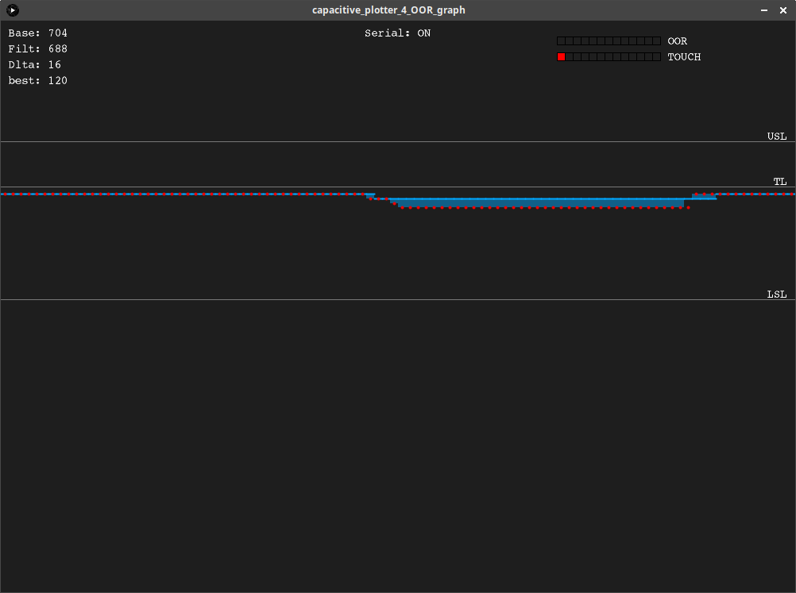

# README

This repos is made to collect working Arduino and Processing code to be used to plot useful data from Arduino controlling one or more MPR121 capacitive sensors.

This graph is though to be used to see OOR registers and complete TOUCHE register.

Remind to set number like this:

Processing _NGRAPH_ = Arduino _NMPR_ * _NPADS_ ;

Remind also to set the same _baudrate_.

